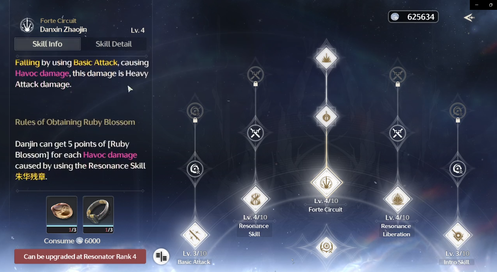
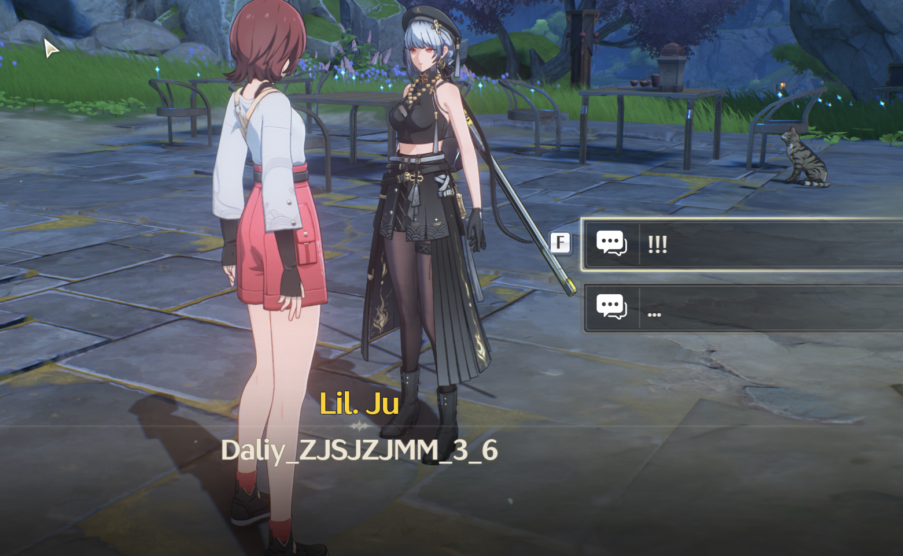

# Video Game Teardown: Wuthering Waves: Closed Beta #2

## Introduction
Kuro Games is a prominent game development studio known for creating Punishing: Gray Raven, a popular action RPG (Role-Playing Game) set in a dystopian future. Founded in 2017, Kuro Games has begun work on their third game titled [Wuthering Waves] (WuWa), and recently closed their second Closed Beta test. They have now announced the release of the game to be May 22nd, 2024.

This game is most similar to [Genshin Impact], another action RPG with similar mechanics. I have over 500 hours spent on the game, but burnt out of the game due to general disinterest of combat mechanics after a while, and lack of motivation to get stronger due to the randomness and bottlenecking of certain game choices. I mention this because a lot of comparrisons I will make will be towards Genshin.

<br>

## Graphics and Visuals

#### Character Design
Each character has a unique look and design which generally reflects their personality and playstyle. However, the gravity physics of some characters are a bit exessive, and the unrealistic motion and design are often a little too much to overlook. More specifically, the chest design of some of the characters are immensely disproportionate and detract from the game. Although I am not an artist, or someone well versed in fashion, I do enjoy the wide range of color scheme and styles of clothing that WuWa is implementing into their game. However, it is quite evident that it appeals to a predominately male audience, with none of the female characters wearing long pants. Instead, all of the female characters are wearing dresses or skin tight leggings with a super short pants.  


[*source*](https://twitter.com/jared_nyts/status/1763960584574226544)

#### World Design
The environment of the world covers a wide array of biomes and color schemes, and each one provides their own unique environmental "feel". The world flows with unique natural and unnatural ways that generate a sense of awe regardless of where one goes to and from. Night time creates a breathtaking view of the stars and galaxy, and I would sometimes even fall down cliffs or into enemies staring at the night sky rather than straight ahead of me.  


<br>

## Gameplay Mechanics
Unlike Genshin, there are no "reactions", or having an effect when two elements react with each other. The elemental system is more basic than Genshin with users only having to think about which element they are using when there are  monsters or bosses have resistances to a specific element. I will, however, argue that this allows users a better ease of entry into the combat system. Genshin contains approximately ten different reactions, each with a unique effect. Not only is this difficult to remember as a new player, but also creates an inherent advantage towards some characters in Genshin. Reactions that are deemed more "meta" will be used at a higher rate than those who are not deemed as useful, which adds a level of convolutedness to the combat system.

WuWa allows teams to only have three members compared to Genshin's four, but the teambuilding necessary to generate a well-rounded composition is still present, if not more than before. For example, some new mechanics are added in the combat system which inscentivizes switching characters at specific points.

#### Movement
The ability to wallrun, grapple, climb, and glide allow for so many different movement options that it rarely feels like a chore to travel around the map or climb mountains, unlike Genshin. Any building, wall, or cliff feels scalable, which incentivizes players to truly explore every part of the immersive world, and is further inscentivized by finding either side quests, or chests. Furthermore, the stamina system is much more freeing compared to Genshin, with WuWa allowing players to sprint without having to use stamina out of combat. This makes traveling much faster, and much more fun compared to the constant wait players have to experience when just trying to sprint from one place to another in Genshin.

<!-- wallrunning -->


#### Skills
Intro and Outro skills are added into the game which are used when the player swaps characters after certain period on the current character. When used, these skills damage, buff, or slow the enemy while also providing an outro / intro animation for the character leaving and entering respectively. Bosses usually also have shields, which are heavily damaged by a character's intro and outro skills. 

*me missing my outro skill on a boss*

Because of the increase in skills and options the player has however, the complexity of combat increases as well. With so many different options, it is difficult to know the ins and outs of every character. For much of the Closed Beta, I found myself picking the characters I found interesting based on story or design, and then only learning their abilities, regardless if other characters synergized better, or fit my playstyle better. The information for each skill is convoluted and messy, and it would benefit from having a short description along with a detailed description that players can see if they choose to. 


*Danjin abilities*


#### Combat

Fighting bossess feel very akin to a souls-like, where the player should be focused on keeping track of the enemy's timings while also remembering the character's own timings and abilities. The rotations between characters are smooth and fast with very little character down time unless the player decides to. With intro and outro abilities, character skills, echo abilities, resonance liberation (the ultimate), forte circuits, and basic attacks, deciding what to do next is much more complex and fast paced compared to Genshin.


In Genshin, there is generally a meta which revolves around using specific characters within a rotation which usually involves having down time. In fact, many of the intense calculations within the community revolve around minimizing such down time as to inflict as much Damage Per Second (DPS) without having to just wait around. As someone who also heavily disliked the down time in Genshin, the fast swappable and highly variable combat system of Wuthering Waves was like a breath of fresh air. 

#### Probability
My biggest critique of the game is it's poor probabilities in many aspects. Although this is used as a "mechanic" for many gacha games to keep players hooked, the probability of WuWa seems a little too unfair. Whether it's trying to get the newest 5 star, or farming to get a better echo to equip to your character, the chances of you getting them are *extremely* small. In terms of Gacha, I much prefer Genshin's system because of their increasing "soft pity" despite the fact that it costs 10 pulls more.


However, the biggest impact on probability comes from echo farming. Instead of artifacts like Genshin, players can equip echos of monsters that they defeat. Although this sounds like an upgrade conceptually, the amount of farming a player must do to achieve a specific echo is much greater and the execution fails to deliver on a better experience. Although I am simplifying the process of echoes, the probability should still be correct. This math is assuming the player is in the end game, and the math is as follows:

```
Probability of enemy dropping an echo at max rank: 20%
Probability of enemy is the highest  rarity: 90%
Probability that echo has the wanted main stat: 50% / 10% / 14% 
Probability that echo has the right set bonus: 11%
Probability that the echo is not a duplicate enemy that is already equipped: 90%
Probability of echo having desired substats (12 substats, pick 4): 4*3*2*1/(12*11*10*9) =  0.2%
Probability substats are in the high range of potential values: 50%
```
The probability of obtaining one of these echoes is 0.000008 / 0.0000018 / 0.0000025 depending on the cost of the echo. This means that the **player will have to farm 125,000 / 555,555 / 400,000** of the same enemy to obtain ONE excellent echo. Remember that the player needs to equip five echoes, which means for one character, they will need to farm millions of enemies.

Furthermore, it costs items to upgrade and obtain substats of echoes, which can be obtained only through quests, chests, or by using stamina, further increasing the immense time sink echoes are to the player.

<!-- echo -->

<br>


## Sound Design
The sound design clearly captures the general aesthetic of the game, with a mixing of both instrumental and electric elements. The music changes depending on what the player is doing (exploring, fighting a boss, etc) and really enhanced the experience. There are sound queues for every enemy attack, parry, character swap, and any other important information that the player may encounter. I would also like to note that it is nice to see that it is accessible even for people with hearing disabilities, as there are also visual cues that also provide that same information.


<br>

## Story and Narrative
#### Storyline
In general terms, the plot follows extremely closely to the "being transported to another world" stereotype that is often used for self-inserts nowadays. To me, it was nothing great, and much of the time I found myself aimlessly clicking through the story rather than enjoying and gathering as much information I could from the text. Although there are moments that are truly made me feel engaged with the story, much of it was because of the animations and music that went along with it rather than the plot itself.

Much like other RPGs, the player occasionally does have the ability to pick between a couple dialogue options. However, these options do not influence the game at all, rather, just provides one or two different text lines, which I always find a little disappointing. 

*My feeling when Daily_ZJSJZJMM_3_6*

#### Syntax
The syntax of the game is hard to pick up, as, although they share a general motif, the amount of technical terms and names provided often left me confused at the beginning. Although they are able to explain and show the most important ones, some are left up to the player to figure out for them selves. Although this did not deter or negatively impact me, I can see it being a problem for a younger playerbase, who aren't able to keep up with the new vocabulary which is sprung on them. 

There are also still some bugs that need to be fixed within the game regarding Syntax. Some quests have not even had their dialogue finished in the english reading mode, and oftentimes refer to females as "he/him" and vice versa.


<br>

## User Interface and User Experience (UI/UX)
The UI of the game is very similar to Genshin, so there isn't much to comment on here. The map system is practically identical (although with different icons), everything is clearly marked. As a personal pet peeve, I hate the red exclamation marks in video games to get your attention, especially if they are overused. Genshin, and now WuWa, is no exception. It immediately takes me out of the game to get the red notification off of my screen regardless of if I'm in the middle of a fight, a quest, or just logging on.


## Conclusion

Overall, I believe that Wuthering Waves will be able to compete on equal footing to Genshin because of its upgrades to several pain-points, along with its gameplay being more condusive to player thinking. It still upholds much of the mechanics of gacha games in general that I still abhor, but because of its fun mechanics and great art style, I will definitely be hooked in once it is finally released. 


[Genshin Impact]: (https://genshin.hoyoverse.com/en/)
[Wuthering Waves]: (https://wutheringwaves.kurogame.com/en/)